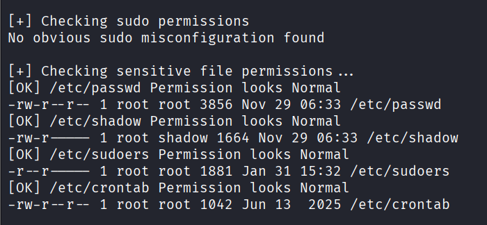
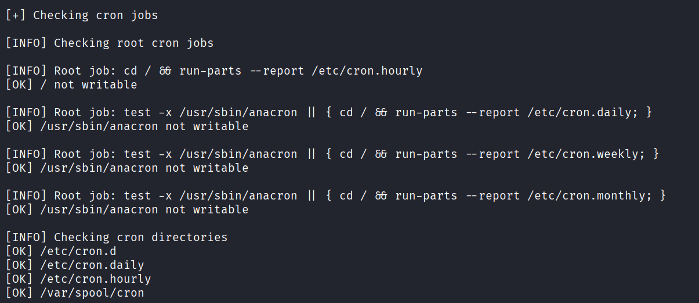
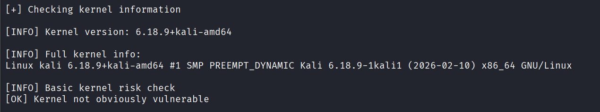
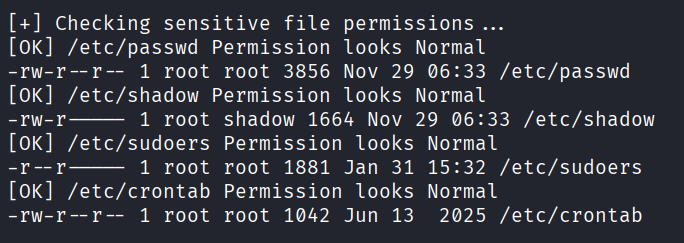

  pyPrivesc

pyPrivesc is a Linux privilege escalation enumeration tool written in Python.
It automates manual enumeration techniques commonly used in HTB, TryHackMe, and real-world pentesting engagements.

 Features

✔ Sudo privilege checks

✔ Writable file detection

✔ Cron job misconfiguration detection

✔ SUID binary scanning

✔ PATH hijack detection

✔ Linux capabilities check

✔ SSH key exposure detection

✔ Kernel information analysis

✔ Running services inspection

  Usage
git clone https://github.com/rhythmsarmaa/pyPrivesc.git
cd pyPrivesc
python3 main.py

## 📷 Example Output

### 🔹 System Info Check
 

### 🔹 Sudo Check

### 🔹 Cron Check

### 🔹 Kernel Check

### 🔹 Weak File Permissions Check

  Purpose

This tool was built to practice automation of Linux privilege escalation techniques and simulate real-world red-team enumeration workflows.

⚠️ Disclaimer

This tool is for educational and authorized testing purposes only.
